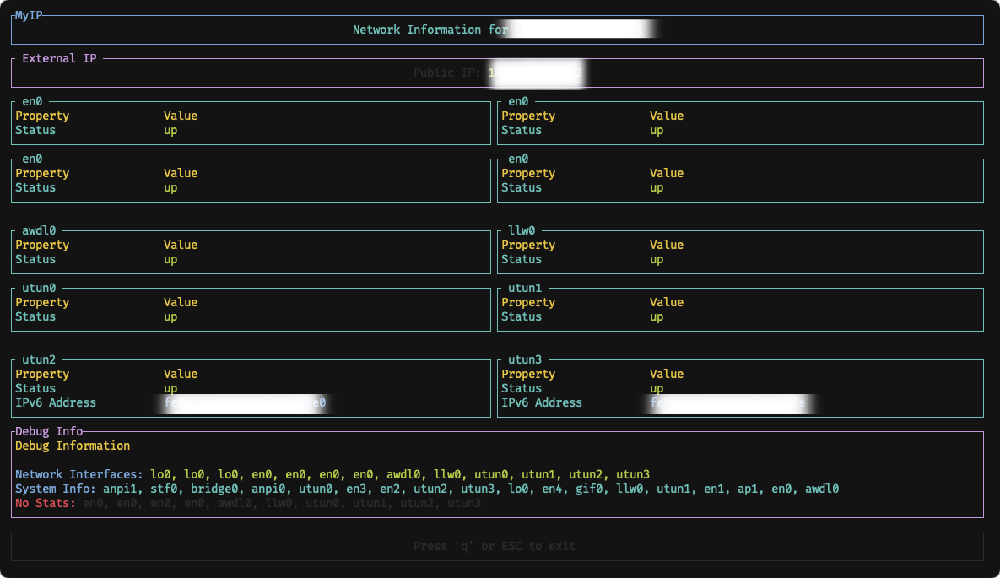

# MyIP

<p align="center">
    
</p>

<p align="center" style="font-size: 18px; font-weight: bold;">A clean, intuitive terminal UI for network interface monitoring.</p>

<p align="center">
  <a href="#features">Features</a> •
  <a href="#installation">Installation</a> •
  <a href="#usage">Usage</a> •
  <a href="#interface-details">Interface Details</a> •
<a href="#contributing">Contributing</a>

</p>

## Features

- **Intuitive Terminal UI**: Color-coded interface built with TUI-rs and Crossterm
- **Real-time Interface Monitoring**: Updates every 500ms
- **Network Information Display**:
  - Interface status (up/down)
  - IPv4 and IPv6 addresses
  - MAC addresses
  - MTU and link speed (when available)
  - Traffic statistics (received and transmitted bytes)
- **Traffic Visualization**: Real-time graphs showing RX/TX activity
- **Public IP Detection**: Attempts to fetch your public IP from multiple services
- **Debug Information Panel**: Shows detected interfaces and diagnostic details
- **Cross-Platform Support**: Works on Linux, macOS, and Windows
- **Smart Interface Detection**: Skips loopback interfaces automatically

## Table of Contents

- [MyIP](#myip)
  - [Features](#features)
  - [Table of Contents](#table-of-contents)
  - [Installation](#installation)
    - [Prerequisites](#prerequisites)
    - [Using Cargo (Recommended)](#using-cargo-recommended)
    - [Setting up PATH](#setting-up-path)
  - [Usage](#usage)
    - [Keyboard Controls](#keyboard-controls)
  - [Interface Details](#interface-details)
    - [Main Screen Elements](#main-screen-elements)
    - [Network Traffic Graphs](#network-traffic-graphs)
    - [Public IP Detection](#public-ip-detection)
  - [Building from Source](#building-from-source)
    - [Dependencies](#dependencies)
  - [Troubleshooting](#troubleshooting)
    - [Common Issues](#common-issues)
  - [Contributing](#contributing)
  - [License](#license)
  - [Acknowledgements](#acknowledgements)

## Installation

### Prerequisites

- Rust toolchain (1.70 or later)
- Network connectivity (for public IP detection)

### Using Cargo (Recommended)

```bash
# Install the latest version
cargo install myip-tui

# Or specify a version
cargo install myip-tui@0.1.0
```

### Setting up PATH

After installation, make sure your Rust binary directory is in your PATH:

```bash
# For Bash users (add to ~/.bashrc)
echo 'export PATH=$PATH:'"$HOME"'/.cargo/bin' >> ~/.bashrc
source ~/.bashrc

# For Zsh users (add to ~/.zshrc)
echo 'export PATH=$PATH:'"$HOME"'/.cargo/bin' >> ~/.zshrc
source ~/.zshrc

# Verify installation
myip
```

## Usage

Simply run the application from your terminal:

```bash
myip
```

### Keyboard Controls

| Key   | Action           |
| ----- | ---------------- |
| `q`   | Quit application |
| `ESC` | Quit application |

## Interface Details

MyIP provides a detailed view of your network interfaces in a clean, organized terminal UI:

### Main Screen Elements

1. **Header**: Displays your hostname
2. **Public IP**: Shows your external IP address (fetched from online services)
3. **Interface Panels**: Each network interface is displayed with:
   - Status (up/down)
   - IPv4 and IPv6 addresses
   - MAC address (when available)
   - MTU and link speed (when available)
   - RX/TX traffic statistics
   - Real-time traffic graph
4. **Debug Panel**: Shows detected interfaces and diagnostic information
5. **Footer**: Displays keyboard controls

### Network Traffic Graphs

Each interface panel includes a real-time graph that visualizes:

- **RX (Download)**: Shown in green
- **TX (Upload)**: Shown in red

The graph automatically scales based on traffic volume and provides meaningful units (B/s, KB/s, MB/s).

### Public IP Detection

MyIP attempts to fetch your public IP address from multiple services:

- api.ipify.org
- ifconfig.me/ip
- icanhazip.com
- ipinfo.io/ip
- myexternalip.com/raw

The application uses a 5-second timeout to ensure responsiveness even if connectivity is limited.

## Building from Source

MyIP is built with Rust and uses several key dependencies:

- **tui-rs**: Terminal user interface library
- **crossterm**: Terminal control and input handling
- **tokio**: Asynchronous runtime
- **reqwest**: HTTP client for fetching public IP
- **sysinfo**: System information gathering
- **local-ip-address**: Network interface detection

To build from source:

```bash
# Clone the repository
git clone https://github.com/yourusername/myip.git
cd myip

# Build in release mode
cargo build --release

# The binary will be available at
./target/release/myip
```

### Dependencies

MyIP requires the following dependencies:

```toml
[dependencies]
tui = { version = "0.19", default-features = false, features = ['crossterm'] }
crossterm = "0.25"
anyhow = "1.0"
local-ip-address = "0.5.1"
tokio = { version = "1", features = ["full"] }
sysinfo = "0.27.8"
nix = "0.26.2"
futures = "0.3"
gethostname = "0.4.1"
reqwest = { version = "0.11", features = ["json", "default-tls"] }
```

## Troubleshooting

### Common Issues

**No Public IP Displayed**

- Check your internet connection
- The application tries multiple services, so one may be blocked
- Ensure you have the `default-tls` feature enabled in reqwest

**Missing Network Statistics**

- Some interfaces may not provide statistics through sysinfo
- The application attempts to fall back to using the `netstat` command
- Check the debug panel for interfaces with missing statistics

**Network Interfaces Not Showing**

- Ensure you're running with appropriate permissions
- Some virtual interfaces or non-standard interfaces may not be detected
- Check the debug panel to see which interfaces were detected

## Contributing

Contributions are welcome! Please feel free to submit a Pull Request.

1. Fork the project
2. Create your feature branch (`git checkout -b feature/amazing-feature`)
3. Commit your changes (`git commit -m 'Add some amazing feature'`)
4. Push to the branch (`git push origin feature/amazing-feature`)
5. Open a Pull Request

## License

This project is licensed under the GNU General Public License v3.0 (GPL-3.0) - see the LICENSE file for details.

## Acknowledgements

- [TUI-rs](https://github.com/fdehau/tui-rs) for the terminal interface library
- [Crossterm](https://github.com/crossterm-rs/crossterm) for terminal control
- [Tokio](https://tokio.rs/) for async runtime
- [Sysinfo](https://github.com/GuillaumeGomez/sysinfo) for system information
- [local-ip-address](https://github.com/EstebanBorai/local-ip-address) for network interface detection
- [Reqwest](https://github.com/seanmonstar/reqwest) for HTTP requests

---
